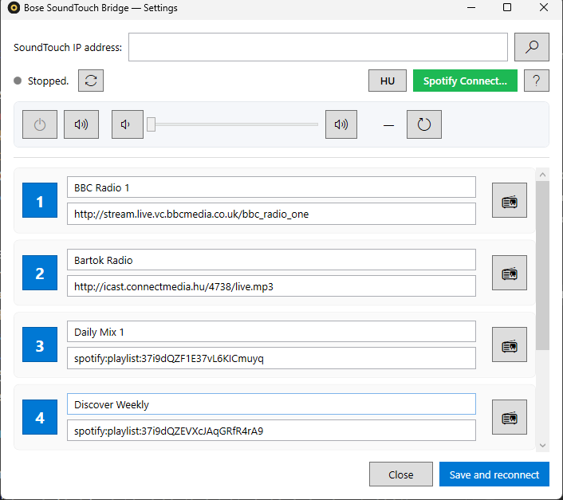

# Bose SoundTouch Bridge

A small Windows tray application that restores the physical 1–6 preset buttons on
Bose SoundTouch speakers after Bose's 2026 cloud retirement. Press a button on
the speaker, and the bridge plays the internet radio station or Spotify playlist
you've configured for that preset.

Bilingual UI (Hungarian / English, auto-detected). Self-contained — bundles the
.NET 10 runtime, no prerequisites on the target machine.



---

## Why does this exist?

Bose retired the SoundTouch cloud in 2026. The local API on the speakers is still
alive (HTTP on port 8090, WebSocket on port 8080, UPnP MediaRenderer on port
8091), but the preset buttons no longer trigger playback through the discontinued
cloud service. This bridge listens to the WebSocket on the LAN, recognises
button-press events, and starts playback locally:

- Internet radio streams via **UPnP AVTransport**
- Spotify playlists / tracks / albums via the **Spotify Web API** (Spotify Connect
  on the speaker, which runs on Spotify's own infrastructure and was not affected
  by the Bose retirement)

The project is a port of the
[Home Assistant add-on by sandervg](https://github.com/sandervg/homeassistant-bose-soundtouch-bridge)
to a standalone Windows desktop app with a settings UI, Spotify support, and an
installer.

---

## Features

- **6 configurable presets** mapped to the speaker's physical buttons
- **Internet radio browser** — search by country / genre / name, ~50k stations
  via [radio-browser.info](https://www.radio-browser.info) community database
- **Spotify Connect support** — paste a `spotify:playlist:…` (or share-URL) into
  any preset; the bridge transfers playback to the SoundTouch via the Spotify
  Web API (requires Spotify Premium)
- **Live device control** — power on/off, mute, volume slider, all wired to the
  SoundTouch HTTP API
- **Network discovery** — SSDP scan to find the speaker without knowing its IP
- **Tray icon** — runs in the background, single-instance, optional auto-start
  with Windows
- **Bilingual** — Hungarian / English, switchable from the main window
- **Self-contained installer** (~43 MB) — single-file `.exe` with the .NET 10
  runtime bundled

---

## Install

1. Download `BoseSoundTouchBridge-Setup-1.0.0.exe` from the
   [Releases](../../releases) page.
2. Run it. Installs per-user by default (no admin required); can be elevated to
   system-wide install.
3. Optional choices during setup:
   - Create a desktop shortcut
   - Start with Windows
4. After install, the app launches and a speaker icon appears in the system
   tray. The settings window opens automatically on first run.

### Uninstall

Settings → Apps → Bose SoundTouch Bridge → Uninstall. The settings file in
`%APPDATA%\BoseSoundTouchBridge\` is **not** removed by the uninstaller, so
reinstalling preserves your presets and Spotify authorisation.

---

## First-time setup

### 1. SoundTouch IP address

- Open the settings window (left-click the tray icon).
- Either type the IP into the top field, or click the 🔍 button to scan the
  network. Pick your SoundTouch from the list.
- Click **Save and reconnect**.
- The status LED next to the address turns green when the WebSocket is
  connected.

**Tip:** reserve a fixed DHCP lease for the speaker's MAC in your router so the
IP doesn't change.

### 2. Internet radio presets

For each preset row:

- Click 📻 to open the radio browser.
- Filter by country (defaults to your Windows region), genre, name. Click a
  column header to sort.
- Double-click a station — its URL and name are inserted into the preset.
- Click **Save and reconnect**.

Manual URLs also work; the bridge automatically rewrites `https://` to `http://`
(the SoundTouch only plays HTTP streams).

### 3. Spotify Connect (optional)

Requires a **Spotify Premium** account. The SoundTouch must already be linked
to Spotify (a one-time setup that was done via the Bose app while it still
worked — verify by checking the device picker in the Spotify app on your phone).

One-time configuration:

1. Open [developer.spotify.com/dashboard](https://developer.spotify.com/dashboard)
   and create a new app (e.g. name "SoundTouch Bridge").
2. Add this exact **Redirect URI**:
   `http://127.0.0.1:38765/callback`
3. Copy the **Client ID** from Settings → Basic Information.
4. In the app: click **Spotify Connect…**, paste the Client ID, click
   **Connect to Spotify**. Approve in the browser.
5. From your phone, start any Spotify playback on the SoundTouch (so it shows up
   as an active Connect device).
6. Back in the app, click **Refresh** under "Spotify Connect device". Pick the
   SoundTouch (type is usually "Speaker"). The **Test** button transfers
   playback to the selected device so you can verify which one it is.

After this, paste any of the following into a preset's URL field:

- `spotify:playlist:37i9dQZF1DXcBWIGoYBM5M`
- `https://open.spotify.com/playlist/37i9dQZF1DXcBWIGoYBM5M?si=…`
- Track, album, artist, podcast (show / episode) URIs also work.

Internet radio and Spotify presets can be mixed freely.

---

## Build from source

### Requirements

- Windows 10/11 (x64)
- [.NET 10 SDK](https://dotnet.microsoft.com/download) — `winget install Microsoft.DotNet.SDK.10`
- (For the installer) [Inno Setup 6](https://jrsoftware.org/isinfo.php) — `winget install JRSoftware.InnoSetup`

### Run from source

```powershell
git clone <repo-url>
cd SoundTouch
dotnet run -c Release
```

### Single-file publish

```powershell
dotnet publish -c Release -r win-x64 --self-contained true `
  -p:PublishSingleFile=true -p:IncludeNativeLibrariesForSelfExtract=true `
  -o .\publish
```

Output: `.\publish\BoseSoundTouchBridge.exe` (~134 MB, includes the .NET runtime).

### Build the installer

```powershell
.\installer\build-installer.ps1
```

Runs `dotnet publish` then `iscc setup.iss`. Output:
`.\dist\BoseSoundTouchBridge-Setup-{version}.exe` (~43 MB compressed).

---

## How it works

| Channel | Protocol | Purpose |
|---|---|---|
| `ws://<ip>:8080` (subprotocol `gabbo`) | WebSocket, XML | Listens for `<nowSelectionUpdated><preset id="N"/>` events |
| `http://<ip>:8090/info` | HTTP, XML | Device info incl. `deviceID` for UPnP descriptor URL |
| `http://<ip>:8090/key`, `/volume`, `/now_playing` | HTTP, XML | Power / mute / volume control, source query |
| `http://<ip>:8091/XD/BO5EBO5E-F00D-F00D-FEED-{deviceID}.xml` | HTTP, UPnP descriptor | Finds `AVTransport` control URL |
| `http://<ip>:8091/{controlURL}` | SOAP/HTTP | `SetAVTransportURI` + `Play` for internet radio (DIDL-Lite metadata) |
| `https://accounts.spotify.com` + `https://api.spotify.com/v1` | Spotify Web API (PKCE OAuth) | Lists Connect devices, transfers playback, starts a playlist URI |
| `239.255.255.250:1900` | SSDP UDP multicast | Network discovery of SoundTouch devices |

When a preset button is pressed on the speaker:

1. Bridge receives the WebSocket event, extracts the preset ID (1–6).
2. Looks up the configured URL for that preset.
3. If it's a Spotify URI → calls `PUT /v1/me/player/play?device_id=X` with the
   `context_uri`. If the device isn't active, transfers playback first and
   retries.
4. Otherwise (internet radio URL) → calls UPnP `Stop` + `SetAVTransportURI` +
   `Play` on the speaker's `AVTransport` service.

---

## Configuration

Settings file: `%APPDATA%\BoseSoundTouchBridge\settings.json`

```json
{
  "ipAddress": "192.168.1.50",
  "language": "hu",
  "presets": [
    { "name": "Bartók Rádió", "url": "http://icast.connectmedia.hu/4738/live.mp3" },
    { "name": "Daily Mix 1",   "url": "spotify:playlist:37i9dQZF1E37vL6KICmuyq" },
    { "name": "", "url": "" },
    { "name": "", "url": "" },
    { "name": "", "url": "" },
    { "name": "", "url": "" }
  ],
  "spotify": {
    "clientId": "...",
    "refreshToken": "...",
    "userName": "user@example.com",
    "deviceId": "...",
    "deviceName": "Bose SoundTouch"
  }
}
```

The `refreshToken` is sensitive — anyone with it can control the linked Spotify
account. Stored as plain text; treat the file accordingly.

---

## Project structure

```
SoundTouch/
├── Assets/
│   └── app.ico
├── Localization/
│   └── L.cs                       — bilingual string table (HU/EN)
├── Models/
│   └── AppSettings.cs             — settings + Spotify config
├── Services/
│   ├── BoseClient.cs              — WebSocket loop, preset routing
│   ├── UpnpClient.cs              — UPnP descriptor + SOAP
│   ├── SoundtouchApiClient.cs     — HTTP API on port 8090
│   ├── DeviceDiscovery.cs         — SSDP scan
│   ├── RadioBrowserApi.cs         — radio-browser.info client
│   └── SpotifyApi.cs              — OAuth PKCE + Web API
├── App.xaml(.cs)                  — tray icon, single-instance, global handlers
├── MainWindow.xaml(.cs)           — settings UI, device controls, preset rows
├── DiscoveryWindow.xaml(.cs)      — SSDP picker dialog
├── RadioPickerWindow.xaml(.cs)    — radio browser dialog
├── SpotifySettingsWindow.xaml(.cs)— Spotify auth + device picker
├── HelpWindow.xaml(.cs)           — help window shell
├── HelpContent.cs                 — programmatic FlowDocument (HU/EN)
├── installer/
│   ├── setup.iss                  — Inno Setup script
│   └── build-installer.ps1        — publish + compile installer
└── BoseSoundTouchBridge.csproj
```

---

## Languages

The UI auto-detects Hungarian (`hu-*` Windows region) or English. Switch at any
time using the **HU / EN** button in the status row of the main window — the app
restarts to apply the change. Settings are preserved across language switches.

Adding a new language: extend `Localization/L.cs` (a single static class with
~100 properties using a `T(hu, en)` helper) and the `HelpContent.cs` builder.

---

## Acknowledgments

- [sandervg/homeassistant-bose-soundtouch-bridge](https://github.com/sandervg/homeassistant-bose-soundtouch-bridge)
  — original Home Assistant add-on; protocol details for the WebSocket events,
  DIDL-Lite metadata, and UPnP descriptor URL pattern come from this project.
- [radio-browser.info](https://www.radio-browser.info) — open community
  database of internet radio stations.
- Bose's local API has been documented by the community over the years
  (e.g. various SoundTouch home automation integrations); this project would not
  exist without that prior work.

---

## License

Specify a license (e.g. MIT) before publishing. Without one, default copyright
rules apply.
